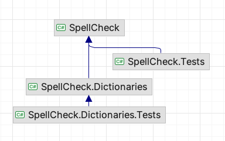

# SpellCheck Offline Library

Offline spell-checking words within texts, including Markdown tags.
This library enables accurate detection of spelling errors
while considering the presence of Markdown formatting.

The library utilizes Open Office's *.dic and *.aff files
to support spell-checking in over 80 languages from around the world.

The library containing built-in languages 
de-DE, en-GB, en-US, es-ES, fr-FR, it-IT, pl-PL, pt-PT
for your convenience and enhances the spell-checking capability by providing preloaded
dictionaries, streamlining the process of checking
text accuracy in different linguistic contexts.

## Features

1. Accurate spell-checking for various languages.
2. Easy integration with Markdown documents.
3. Flexible options to customize dictionaries and ignored words.
4. Extensible and user-friendly API.
5. Built-in languages: de-DE, en-GB, en-US, es-ES, fr-FR, it-IT, pl-PL, pt-PT
6. [MIT License](LICENSE.txt)
7. Fell free to make a pull request.

## How to use

The SpellCheck library can be used to perform various spell-checking tasks. 
Here's an example of how to get started:

### Installation

Install the [NuGet package](https://www.nuget.org/packages/SpellCheck.Dictionaries) 
from the package manager console:

```powershell
Install-Package SpellCheck.Dictionaries
```

### SpellCheck

Using of `SpellCheck` class is very simple. 
Just create an instance of `SpellCheck` class and use it.

```csharp
using SpellCheck;

// Create a SpellCheck instance
var spellChecker = SpellCheck.CreateFromFiles("en-US.dic", "en-US.aff");
spellChecker.SetIgnoredWords("bulba", "kotek");

// Perform spell-checking
var isCorrect = spellChecker.IsWordCorrect("hello"); // true
var isCorrect = spellChecker.IsWordCorrect("kotek"); // true
var isCorrect = spellChecker.IsWordCorrect("adsasd"); // false
var isTextCorrect = spellChecker.IsTextCorrect("This is an example text."); // true

// Get suggestions for an incorrect word
var suggestions = spellChecker.SuggestWord("wor"); // ["world", "worm", "worn", "worst", "wore", "word"]

// More advanced usage is possible as well
```

Use this class in the way above if you want to use your own dictionaries 
and don't want to use built-in dictionaries.

### Built-in dictionaries 

Much simpler way to use `SpellCheck` class is to use built-in dictionaries.

```csharp
using SpellCheck.Dictionaries;

var factory = new SpellCheckFactory();
// Create a SpellCheck instance
var spellChecker = factory.Create("en-US");

// Create a SpellCheck instance from current culture
var anotherSpellChecker = factory.Create(CultureInfo.CurrentCulture);
```

There are some built in dictionaries for the following languages:

| Language     | Culture | Dictionary | Affix file |
|--------------|---------|------------|------------|
| Deutsch      | de-DE   | de_DE.dic  | de_DE.aff  |
| English (US) | en-US   | en_US.dic  | en_US.aff  |
| English (GB) | en-GB   | en_GB.dic  | en_GB.aff  |
| Español      | es-ES   | es_ES.dic  | es_ES.aff  |
| Français     | fr-FR   | fr_FR.dic  | fr_FR.aff  |
| Italiano     | it-IT   | it_IT.dic  | it_IT.aff  |
| Polish       | pl-PL   | pl_PL.dic  | pl_PL.aff  |
| Português    | pt-PT   | pt_PT.dic  | pt_PT.aff  |

### Custom dictionaries

```csharp
using SpellCheck.Dictionaries;

var factory = new SpellCheckFactory("C:\Dictionaries");

// Create a SpellCheck instance from files ar-SR.dic and ar-SR.aff
// in the C:\Dictionaries directory
var spellChecker = factory.Create("ar-SR");
```

If the directory is not specified, the current directory is used.

`SpellCheck` works with dictionaries and affix files comming from Open Office [Hunspell format](https://hunspell.github.io/).
If you need more languages, you can download them from [this GitHub repository](https://github.com/titoBouzout/Dictionaries)
and put them into destination directory to work with. These files are in UTF-8 format.

Another way is to go to the website [softmaker.com](https://www.softmaker.com/en/download/dictionaries) 
and download dictionary you wish. A total of 85 language dictionaries are available. 
After downloading, change the file name extension `.sox` to `.zip` and open the file. You should see some files inside.
Unpack `*.dic` and `*.aff` files to the destination directory, an that's all. 
You can use these files by `SpellCheck` and `SpellCheckFactory` classes.

If you're using the `SpellCheck` class alone, 
the `*.dic` and `*.aff` files should be in UTF-8 format. 
If they're not, you can convert them using the  
[iconv tool](https://www.fileformat.info/tip/linux/iconv.htm) or 
include the following code before the first use of the `SpellCheck` class:

```csharp
Encoding.RegisterProvider(CodePagesEncodingProvider.Instance);
```

This step is unnecessary if you're using `SpellCheckFactory` class.

## Class dependency diagram



## Links

1. [Hunspell website](https://hunspell.github.io)
2. [Hunspell .NET GitHub](https://github.com/aarondandy/WeCantSpell.Hunspell/)
3. [Markdig markdown parser GitHub](https://github.com/xoofx/markdig)
4. [Dictionaries to download](https://www.softmaker.com/en/download/dictionaries)